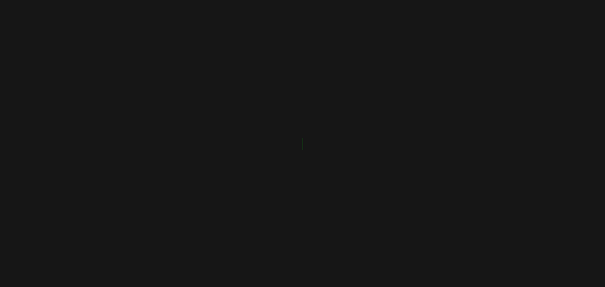

# 
FRONT-END CHALLENGES

A repository that group challenges to improve your skills.

 

 

<table align="center" width="100%">
<tr>
<th>
Challenge Name
</th>
<th>
Technologies
</th>
<th>
Difficult
</th>
</tr>
<tr>
<td>
CSS Typing Animation
</td>
<td>
HTMl & CSS
</td>
<td>
Easy
</td>
</tr>
</table>

